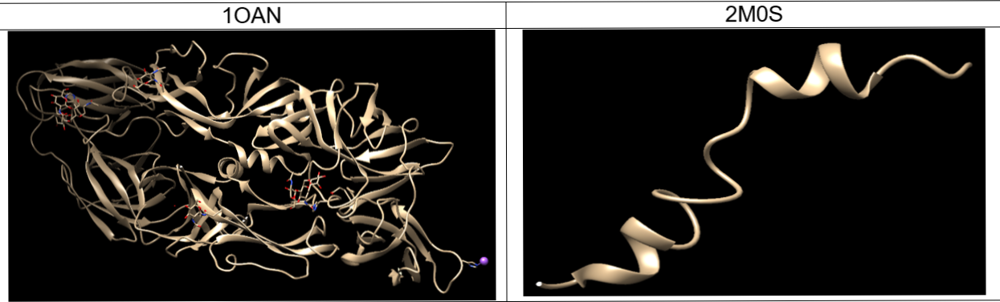
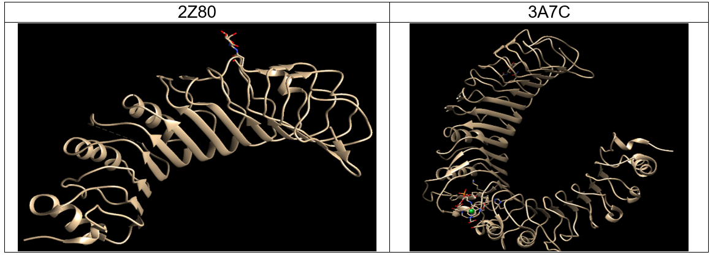
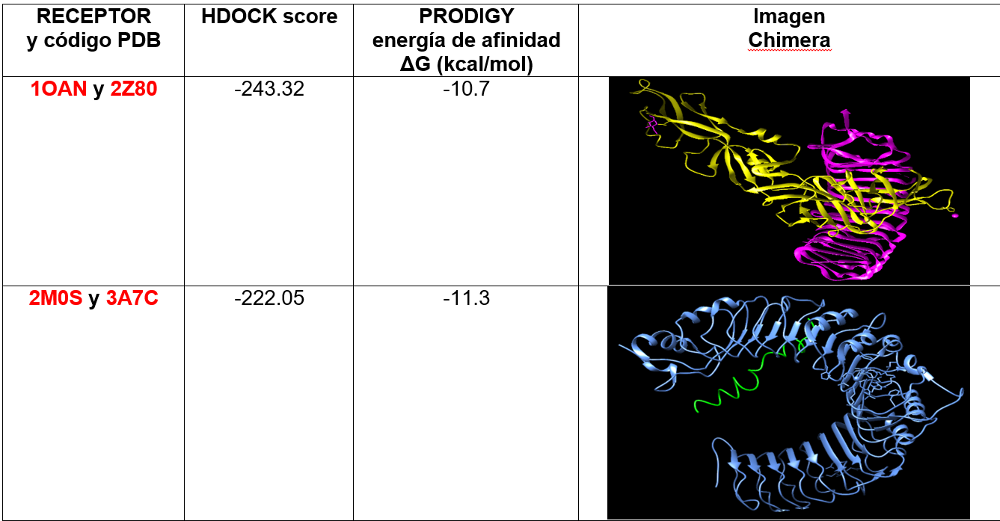
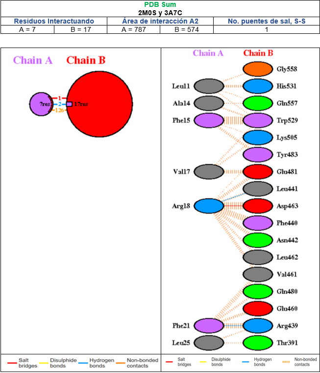

## AQUI VA EL TITULO DE NUESTROS ANTIGENOS

### Introducción
Describe de qué trata tu proyecto:

_A principios de 2020, la pandemia por SARS-COV-19 aún no significaba lo que hoy en día es en la mayoría de las naciones del mundo; al poner a prueba a cada uno de los países, poco a poco el potencial de crear impactos sociales, económicos y políticos devastadores aumenta dejando profundas y duraderas cicatrices.
Los Clubes de Ciencia 2021 buscan participar con los retos globales para un desarrollo sostenible, y para esto los clubes se crearon a base de uno o más ODS. Garantizar una vida sana y promover el bienestar en todas las edades es esencial para el desarrollo sostenible ha sido el principio fundamental para que la Organización de Naciones Unidas (ONU) designara como ¨Salud y Bienestar¨ al Objetivo de Desarrollo Sostenible 3 en la agenda 2030._

_El uso de las tecnologías de última generación puede lograr la erradicación de agentes patógenos que afectan a la humanidad. La bioinformática es la disciplina científica y tecnológica en la que interaccionan en armonía los principios de la Biología Genética y Molecular con los enfoques metodológicos y tecnológicos de la Ciencia de la Computación y la Ingeniería Informática para la obtención y gestión del conocimiento biológico genómico y proteómico._

_En este proyecto usaremos una proteína viral y una glicoproteína del Virus del Dengue y mediante el ¨Docking Molecular¨, buscaremos predecir energías y modos de enlace entre ligandos y proteínas receptoras tipo toll, así como información de gran utilidad en el estudio de nuevos compuestos con efectos terapéuticos para impulsar como precedente a los jóvenes, al desarrollo de vacunas._

### Métodología
_Inmunología_ : Para entender acerca de los virus hay que conocer los principios básicos sobre inmunología. 
•	Identificación del problema
•	Conocer la metodología general del curso 
•	Estudio de los conceptos básicos en Inmunología 	
•	Estudio de la estructura de un Anticuerpo y su fisiología
•	Estudio de la estructura y morfología de un virus
•	Análisis de la reacción Antígeno-anticuerpo 
•	Vacunología reversa 

_Programas y herramientas de trabajo_ : Presentación de los bases de datos y programas que se utilizarán a lo largo de proyecto
•	Estudio de las bases de datos ¨NCBI¨ y ¨PDB¨.
•	Exploración y uso de los programas ¨Jalview¨ y ¨Chimera¨.
•	Estudio de las estructuras moleculares en la plataforma ¨PDB¨.
•	Uso de los plataformas como “HDOCK”, ¨Prodigy¨ y ¨PDBsum¨.

_Proyecto_ : Los estudiantes seleccionarán proteínas de interés para trabajar en el proyecto 
•	Buscar 4 antígenos en PDB como opciones para su estudio.
•	Selección de 2 proteínas para el proyecto.
•	Selecciones de 2 receptores tipo toll para su pareamiento. 
•	Uso del programa ¨Chimera¨. 
•	Docking molecular con “HDOCK” y ¨PDBsum¨.
•	Análisis de datos en “Prodigy”.
•	Diseño de la página web en GitHub. 

### Resultados

Investigar en la base de datos PDB las proteínas a escoger, siendo estas proteínas de superficie de virus.
Una vez hecho esto, visualizar y purificar las cadenas de interés en Chimera.
Las proteínas escogidas fueron: 

Se deben elegir receptores tipo Toll, al investigar se encuentra la afinidad del Virus Dengue, de donde provienen ambas estructuras, con los receptores tipo Toll 2.

_Fuente:
Durán, Anyelo, Álvarez-Mon, Melchor, & Valero, Nereida. (2014). Papel de los receptores tipo toll (TLRs) y receptores para dominios de oligomerización para la unión a nucleótidos (NLRs) en las infecciones virales. Investigación Clínica, 55(1), 61-81. Recuperado en 21 de agosto de 2021, de http://ve.scielo.org/scielo.php?script=sci_arttext&pid=S0535-51332014000100008&lng=es&tlng=es. _

Consiguiente a esto, se utiliza la plataforma HDOCK, para la unión de nuestros antígenos y los receptores TLR2 correspondientes.
Obtenido el resultado, se introducen los archivos .pdb a Prodigy para obtener la energía libre de Gibbs y corroborar la interacción entre proteínas.

Procesar los archivos obtenidos en la plataforma PDB Sum.

### Conclusiones

Los resultados aquí mostrados reflejan la interacción que tienen los receptores señalados con los antígenos correspondientes, esto es de suma relevancia ya que gracias a este tipo de técnicas y herramientas bioinformáticas es como se desarrolla la creación de vacunas o tratamientos de enfermedades infecciosas, ya que al identificar estas interacciones, se logra conocer el tipo de respuesta que se tiene por parte del sistema inmune en este caso innato con los receptores tipo toll, ante los antígenos del virus del dengue, un claro ejemplo de como el conocer estos datos se utiliza y es el futuro del conocimiento correcto de nuestro sistema inmunológico ante agentes patógenos, así como su manejo y el desarrollo de tratamientos preventivos.
En este club se desarrollaron bases de algunas habilidades bioinformáticas importantes, así como un interés sobre la complejidad de la adaptación de los virus y los anticuerpos, en tiempo y complejidad biológica.
Si bien se concluyó que el sistema inmune se adapta más rápido, no en todos los casos es así, por lo que desarrollar técnicas de ayuda, es de suma importancia para el planeta. Por lo que se reafirma la importancia de este factor “Salud y Bienestar” como Objetivo de Desarrollo Sostenible 3 en la agenda 2030 de la ONU.  

